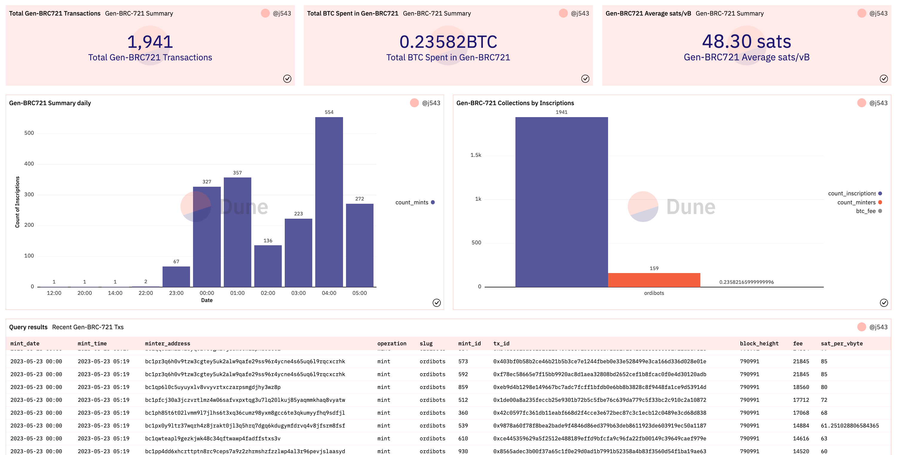
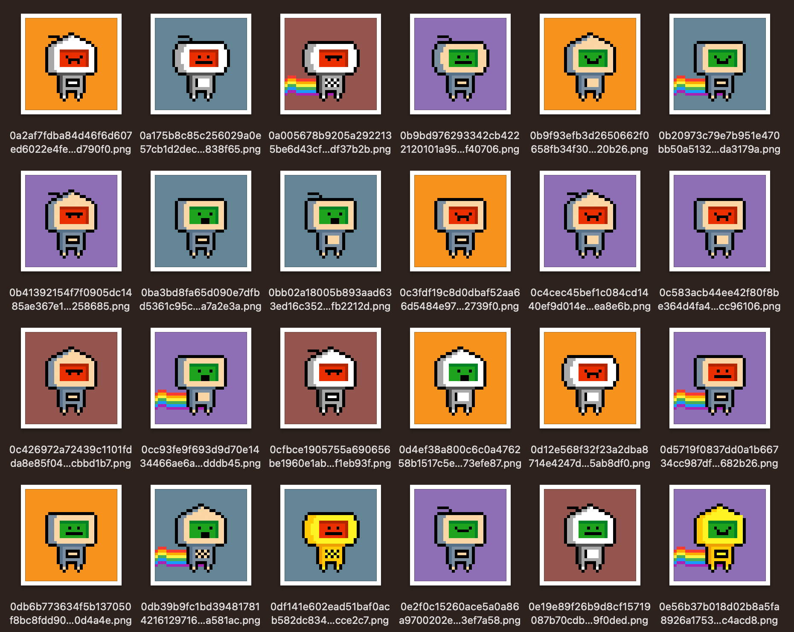

# Generative BRC-721

> ***TLDR**: This proposal introduces the Generative BRC-721 standard, a solution to optimize block space usage in the Bitcoin ordinals ecosystem, accommodating more creators and fostering innovation. The standard utilizes a "deploy" operation to create a Generative BRC-721 collection with unique traits stored on-chain. A "mint" operation then generates Non-Fungible Ordinals, referencing the traits from the deploy operation. This process cuts down block space usage between 50% and 90%. The impact of the proposed standard was demonstrated through a case study with a Generative BRC-721 collection called "OrdiBots," showing a block space reduction of 55%. Front-ends will need to adapt to recreate and display images from the mint inscription text data. This proposed standard lays the groundwork for efficient, decentralized innovation in the Bitcoin blockchain.*

This initiative seeks to spark more conversations around the Non-Fungible standard within the Bitcoin ordinals ecosystem. It aims to enhance the efficiency of launching Image Ordinals Collections, similar to the creation of fungible tokens through the BRC-20 standard.

**Dune Dashboard Demo:** [Generative BRC-721 (WIP)](https://dune.com/j543/generative-brc-721)
This Dune Analytics dashboard currently serves as a tool to monitor the minting activity of specific Generative BRC-721 collections. Please note that it may require further refinements to fully meet the needs of users.



## Context

With Bitcoin network fees surging and settling at a new higher equilibrium, an influx of creators is joining the space. This trend is increasing demand for Bitcoin block space, expected to rise even further in the near future. To keep the door wide open for creators to launch their innovative ideas on the Bitcoin blockchain, we must optimize the current standard for launching Image Ordinals Collections.

## Idea

We propose a new standard for launching Non-Fungible Generative Ordinals collections. This standard can conserve all on-chain resources while achieving a 50% to 90% optimization of the block space. The process includes three main operations:

- Create a Generative BRC-721 collection with the deploy operation
- Mint a Non-Fungible Ordinal of the collection with the mint operation
- Transferring the Non-Fungible Ordinal as a standard ordinal inscription.

All these processes can be conducted without the need for an external indexer, provided that the collection creators release the official list of inscriptions of their collections, as currently required.

## Operations

### Deploy Generative BRC-721

The Deploy operation is a JSON/Text inscription that contains the general information of the collection, and the base64 encoded data of the traits composing the collection. The unique images of the traits used to create the Non-Fungible Ordinals are stored on-chain in this inscription. The inscription serves as the reference and the definitive source of the traits.

Note: It is also possible to create multiple deploy inscription for the same collection, that each will store a set of different traits. 

*For demonstration purposes, we're using the OrdiBots collection*
*Example of a deployed operation inscription: [Ord.io](https://www.ord.io/8326719)*

```javascript
{
    "p": "gen-brc-721",
    "op": "deploy",
    "slug": "ordibots",
    "name": "OrdiBots",
    "supply": 1000,
    "trait_types": [
        "background",
        "accessories",
        "body",
        "belly",
        "face"
    ],
    "dim": [32,32],
    "traits": {
        "background": {
            "blue": {
                "name": "Blue",
                "base64": "iVBORw0KGgoAAAANSUhEUgAAACAAAAAgAQMAAABJtOi3AAAAA1BMVEVkhZa3PARZAAAAC0lEQVR4AWMY5AAAAKAAAVQqnscAAAAASUVORK5CYII="
            },
            ... // more backgrounds
        },
			  "accessories": {
            "antenna": {
                "name": "Antenna",
                "base64": "iVBORw0KGgoAAAANSUhEUgAAACAAAAAgCAYAAABzenr0AAAAKUlEQVRYCe3BsQ0AIADDsOT/o8sJLEgssSHJhTpg4oDxmzKSJEmS5KEDUlIFA6L+DvwAAAAASUVORK5CYII="
            },
              ... // more accessories
        },
        	... // other traits
    }
}
```

| Key         | Required | Description                                                  |
| ----------- | -------- | ------------------------------------------------------------ |
| p           | YES      | Protocol: Helps other systems identify and process gen-brc-721 events |
| op          | YES      | Operation: Type of event (Deploy, Mint)                      |
| slug        | YES      | Slug: Identifier of the collection. Not enforced if no indexer implemented |
| name        | NO       | Name: Human readable name of the collection                  |
| supply      | NO       | Supply: Supply of the collection. Not enforced if no indexer implemented |
| trait_types | YES      | Trait Types: This is an array which dictates the sequence in which the traits ought to be rendered. |
| dim         | NO       | Dimensions: An array representing the dimensions (width and height) of the trait and final images  in pixels, defined as [width, height]. |
| traits      | YES      | Traits: Object containing the unique traits of teh collection. Composed as: {trait type: {trait key: {name, base64 image encoded}}} |


### Mint Generative BRC-721

The Mint operation utilizes a JSON/Text inscription that encapsulates information about the actual Non-Fungible Ordinal being minted and the references to the Deploy inscription(s). The aim is to store the values of the attributes that generate the image, the hash of the final image, and the references of the collection Deploy inscription(s) on-chain. This approach allows anyone to recreate the image using on-chain inscribed data.

*For demonstration purposes, we're using the OrdiBots collection*
*Example of a mint operation inscription:* [Ord.io](https://www.ord.io/8400075)

```javascript
{
   "p":"gen-brc-721",
   "op":"mint",
   "s":"ordibots",
   "t_ins":[
      "b7205d40f3b1b1486567f0d6e53ff2812983db4c03ad7d3606812cd150c64802i0"
   ],
   "h":"aa0d33b748e0177528a910a56a61c47bee2ba9b69749228d6520049c0fea3f4f",
   "id":"554",
   "a":[
      [0,"bitcoin-orange"],
      [0,"rainbow"],
      [0,"black-and-white-triangular"],
      [0,"square"],
      [0,"happy"]
   ]
}
```

| Key   | Required   | Description                                                  |
| ----- | ---------- | ------------------------------------------------------------ |
| p     | YES        | Protocol: Helps other systems identify and process gen-brc-721 events |
| op    | YES        | Operation: Type of event (Deploy, Mint)                      |
| s     | YES        | Slug: Identifier of the collection. Not enforced if no indexer implemented |
| t_ins | YES        | Traits (Deploy) Inscription: Array containing the inscription ID(s) of the deploy inscription(s) |
| h     | ~~YES~~ NO | Hash: This refers to the SHA256 output of the generated image. <u>It's an optional element</u>; collection creators have the flexibility to decide if they want to include this additional security check on their collections. Opting not to use the hash can enhance the efficiency of the inscription process. |
| id    | ~~NO~~ YES | Token ID: Unique identifier for each Non-Fungible Ordinal within the collection. Essential for tracking and distinguishing individual NFOs. |
| a     | YES        | Attributes: This is an array that carries the attribute values of this specific Non-Fungible Ordinal. Each array element is structured as follows: [inscription_index, traits_value]. <br />Here, the inscription_index represents the deploy inscription containing the base64 data of the corresponding trait, and traits_value denotes the actual value of the specific trait. The sequence of elements in the "a" array should correspond with the "trait_types" key ordering from the deploy inscription. <br />As an example, the ordering in this case would be: (1) background = bitcoin-orange; (2) accessories = rainbow; (3) body = black-and-white-triangular; (4) belly = square; (5) face = happy. |

## Impact

Implementing the Generative BRC-721 standard will enhance the efficiency of Bitcoin block space utilization. As the unique traits' images are inscribed just once in the deploy transaction, the assets are composed of a text file referencing these traits. Anyone can then recreate the image using the on-chain deploy inscription and verify the results with the SHA256 output.

### Case Study: OrdiBots

To demonstrate the implementation of this proposed standard, we launched a demo Generative BRC-721 collection called OrdiBots. This collection of 1,000 ordinals, composed of 26 different traits, showed a 55% reduction in block space with the new standard. This result indicates a potential for even greater efficiency with more complex traits collections.

 The 1,000 images combined have a total size of around 663kb. At the current network fee of around 30 sats/vB, the cost to inscribe the whole collection is about 0.293BTC ($7,850 at current price). By implementing the Generative BRC-721 standard, we can reduce the size of the whole collection to 294kb (10kb + 284kb), thus having a total expected reduction of about 55% of block space. This can be considered a lower threshold, since OrdiBots is already a very light collection, and we can expect greater efficiency with collection generated by more complex traits. 

- Deploy inscription: https://www.ord.io/8326719 (10kb)
- All possible assets inscription file: [ordibots-assets.json](https://luminex-public.s3.eu-west-1.amazonaws.com/collections/ordibots/ordibots-assets.json) (284kb)
- Example Mint inscription: https://www.ord.io/8400075 (344 bytes)



### Front-ends

Should this standard become adopted by a wide array of collections and creators, front-end interfaces will need to adjust to display the actual image generated by the mint inscription, rather than the text data. This can be accomplished seamlessly by scanning user text inscriptions for a "gen-brc-721" inscription. The image can then be regenerated using exclusively on-chain data, and subsequently stored within their system infrastructure, in much the same way as it is currently done.

Indeed, most ordinal platforms do not query the blockchain every time an image inscription needs to be displayed to users. Instead, they typically store these images within their own databases for convenience and efficiency. Implementing this standard, thus, shouldn't pose significant changes to the prevalent methodology.

### Re-create Onchain Images

To reconstruct images from a deploy inscription, we can employ a simple script as detailed below. This script will not only generate the base64 encoded image but also its corresponding hash, taking as input the mint operation format described earlier.

However, it's crucial to note that this script serves as an illustrative example and might not cover all scenarios comprehensively at this point.

```javascript
const fetch = require('node-fetch');
const { createCanvas, Image } = require('canvas');
const crypto = require('crypto');

async function createImage(attributes, t_ins) {
    let baseImg;
    let ctx;

    let promises = [];
    let images = new Array(attributes.length);

    for (let i = 0; i < attributes.length; i++) {
        let attribute = attributes[i];
        let inscriptionIndex = attribute[0];
        let traitValue = attribute[1];

        let traitsInscriptionId = t_ins[inscriptionIndex];

        let promise = fetch('https://ordinals.com/content/' + traitsInscriptionId)
            .then(res => res.json())
            .then(data => {
                // Map the index of the attribute to the corresponding trait_type
                let traitType = data.trait_types[i];

                let base64ImageString = data.traits[traitType][traitValue]['base64'];

                let img = new Image();
                let [x_dim, y_dim] = data.dim || [32, 32];  // Default to [32, 32] if 'dim' is not defined

                baseImg = createCanvas(x_dim, y_dim);
                ctx = baseImg.getContext('2d');

                return new Promise((resolve, reject) => {
                    img.onload = () => {
                        // Instead of drawing the image here, store it in the array
                        images[i] = img;
                        resolve();
                    };
                    img.onerror = reject;

                    img.src = "data:image/png;base64," + base64ImageString;
                });
            });

        promises.push(promise);
    }

    await Promise.all(promises);
    // Now draw the images in order
    for (let i = 0; i < images.length; i++) {
        if (images[i]) {  // Check if the image was successfully loaded
            ctx.drawImage(images[i], 0, 0);
        }
    }
    return baseImg.toDataURL();
}

// Parse the command-line arguments as JSON
var obj = JSON.parse(process.argv[2]);

// adjust the dimensions of the image. In this case is set to 32x32
createImage(obj.a, obj.t_ins).then(data => {
    // Split the data from the prefix
    let [prefix, base64Data] = data.split(",");

    // Convert the base64 string into bytes
    let imgBytes = Buffer.from(base64Data, 'base64');
    console.log('base64:', base64Data)
    // Compute the SHA256 hash of the bytes
    let hash = crypto.createHash('sha256');
    hash.update(imgBytes);

    let hashHex = hash.digest('hex');
    console.log('*********************')
    console.log('hash:', hashHex)
}).catch(error => {
    console.error(error);
});
```

